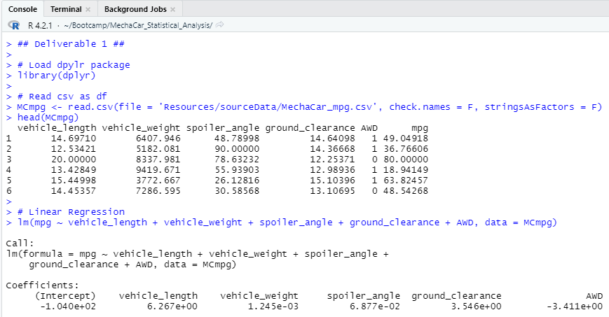
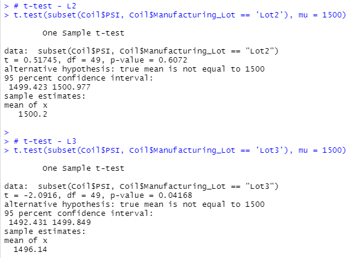

# MechaCar Statistical Analysis

## Overview of MechaCar Analysis

Jeremy has worked with AutosRus, a ficticious automotive company, for more than 10 years.  In his time, he has seen a lot of cars come and go.  Now the company is starting to move their decision making process into the 21st century.  Because Jeremy has numerous connections and exhaustive knowledge of the product, he has been selected to lead the newly created data analytics team.  The data analytics team is responsible for performing retrospective analysis of historical data, analytical verification and validation of current automotive specifications, and study design of future product testing.  

Since the most successful car launches incorporate data analytics in every decision making process, Jeremy must ensure his analysis has statistical backbone, quantitative metric, and a clear interpretation of the results to keep upper management happy.  If that wasn't challenging enough, the data analytics team only knows R.  

This analysis will use R to provide summarization of different variables, visualizations for different datasets, and my interpretation of statistical test resulsts.  Finally, we will use our creativity and critical thinking skills to come up with our own study design to make AutoRus's decision making process even better. 
 
### Resources

* Resources:  MechaCar_mpg.csv,  Suspension_Coils.csv
* Software:  R Studio, R, Visual Studio Code, 1.38.1

## MechaCar Analysis Results

## Deliverable #1:  Linear Regression to Predict MPG

*  Which variables/coefficients provided a non-random amount of variance to the mpg values in the dataset?

By using the slope coefficients, we can determine each variables impact on miles per gallon (mpg).  In our analysis, vehicle length and ground clearance have the most pronounced impacts on mpg.  This is because vehicle length and ground clearance have large positive slope coefficients.      

*  Is the slope of the linear model considered to be zero? Why or why not?

Because the p-value for this analysis (5.35e-11) is much smaller than a normal assumed significance level (0.05), we can reject the null hypothesis based on sufficient evidence.  This additional fact indicates that the slope of the linear model is not zero.

*  Does this linear model predict mpg of MechaCar prototypes effectively? Why or why not?

This linear model has a coefficient of determination (r-squared value) of 0.7149.  This means that 71.5% of mpg outcomes can be predicted using this model.  The coefficient of determination represents how well the regression model approximates real-world data points.  

## Deliverable #2:  Summary Statistics on Suspension Coils

*  The design specifications for the MechaCar suspension coils dictate that the variance of the suspension coils must not exceed 100 pounds per square inch. Does the current manufacturing data meet this design specification for all manufacturing lots in total and each lot individually? Why or why not?

In total, the variance of the suspension coils is well under 100 pounds per square inch (psi).  When we look at the lots individually, we see that Lots 1 and 2 are under the acceptable variance threshhold.  However, Lot 3 is exceeds the acceptable level of suspension coil psi variance (170.3 psi versus 100.0 psi).  The difference likely arises because the total smooths the impacts of outlier data points (like Lot 3).    

## Deliverable #3:  t-Tests on Suspension Coils

*  Summary of t-Test:  
    
Using t-tests, we attempted to quantify the variability between all manufacturing lots and each lot individually when compared against the population mean of 1,500 psi.  We concluded that there is no statistical variance between Lots 1 and the population mean of 1,500 psi.  However, Lots 2 & 3 had low p-values leading us to reason that there is a statistical variance between those lots and the population mean of 1,500 psi. 

## Deliverable #4:  Study Design:  MechaCar vs. Competition

*  Summary of Study:

To drive our analysis home and really please the C suite, we want to pitch a new study.  This new study will put AutoRus on the cusp of automotive innovation.  

*  What metric or metrics are you going to test?

We'd like to understand the relationship between the vehicle occupant capacity and fuel economy.  This study intends to understand the variables that will result in the the most fuel efficient automobiles PER OCCUPANT.  These vehicles could be the future of economical public transit. 

*  What is the null hypothesis or alternative hypothesis?

Null hypothesis (H sub 0):  There is no statistical relationship between fuel economy and our captured metrics.

Alternate hypothesis (H sub a):  Lower vehicle weight, smaller engine size, and lower loaded weights lead to better fuel economy per occupant.

*  What statistical test would you use to test the hypothesis? And why?

The best statistical tests for our hypthesis are linear regression and t-tests.  Similar to the analysis we just performed, we need to determine outlier configurations when compared against a population.  Linear regression helps test the relationship between dependent and independent variables.  We would use that to see what variables most influence fuel economy.  The t-tests will be used to compare the many car configurations against one another. 

*  What data is needed to run the statistical test?

In addition to the data points already collected in our current analysis, we will need to capture new data points on fuel economy, vehicle capacity, loaded weight, and engine size.

## MechaCar Analysis Code Snippets

### Deliverable #2:
